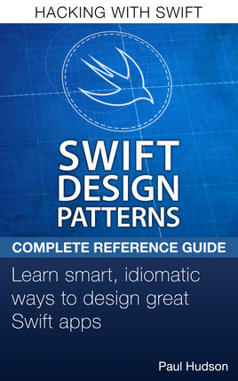

# Swifty Portfolio

_A handy portfolio of endeavors that have been the substrate for my skillz as a Swift/iOS/Apple-platforms engineer_.

(You can also check out some of the [Web development-related stuff](https://github.com/BrianSipple) I've done if you really want to (But do you really want to? 😛)).

 
 

# 📚 Books and Courses

## [App Development with Swift](https://github.com/CypherPoet/book--app-development-with-swift)

  

_Projects, playgrounds, and notes made while following along with Apple's book "App Development With Swift"._

 

## [Ray Wenderlich: iOS Apprentice](https://github.com/CypherPoet/book--iOS-apprentice)

  

_Projects make while following along with the Ray Wenderlich book, [iOS Apprentice](https://store.raywenderlich.com/products/ios-apprentice)_.

 

## Pro Swift

  

_Projects, playgrounds, and notes made while following along with Paul Hudson's book [Swift Design Patterns](https://www.hackingwithswift.com/store/swift-design-patterns)._

 

## Swift Design Patterns

  

_Projects, playgrounds, and notes made while following along with Paul Hudson's book [Swift Design Patterns](https://www.hackingwithswift.com/store/swift-design-patterns)._

 

## [Ray Wenderlich: Concurrency by Tutorials](https://store.raywenderlich.com/products/concurrency-by-tutorials)

  

_Projects, playgrounds, and other materials made while following along with the Ray Wenderlich book ["Concurrency by Tutorials"](https://store.raywenderlich.com/products/concurrency-by-tutorials)_.

 

## Advanced iOS: Volume 1 (Personally extended with SwiftUI ⚡️)

  

_Projects, playgrounds, and notes made while following along with Paul Hudson's book [Advanced iOS: Volume 1](https://www.hackingwithswift.com/store/advanced-ios-1)._

 

## [Ray Wenderlich: Core Data by Tutorials](https://store.raywenderlich.com/products/core-data-by-tutorials)

_ _.

Haters gonna hate, but personally, I love Core Data. Using this book to dive deeply into its inner workings &mdash; while also experimenting with Apple's new Core Data CloudKit support &mdash; was a real treat.

 

## [Flight School: Codable]

## Advanced Apple Debugging & Reverse Engineering

 
 

# 🎓 Courses

## Hacking with Swift / 100 Days of Swift

  

After initially [completing the projects](https://github.com/CypherPoet/book--hacking-with-swift) in Paul Hudson's book [_Hacking with Swift_](https://www.hackingwithswift.com/read), I revisited the material as part of his [_100 Days of Swift_](https://www.hackingwithswift.com/100) challenge to [further share](https://github.com/CypherPoet/100-days-of-swift) what I was learning [with the rest of the community](https://twitter.com/cypher_poet/status/1091857908281806848).

The material here paints a pretty broad brush across the iOS ecosystem, but as I got further in to the book, I started extending each project to focus on with making more fully formed apps and experimenting with different architectures.

In particular, I [extended the Core Data project](https://github.com/CypherPoet/book--hacking-with-swift/tree/master/38-core-data-github-commits/Github%20Commits) to use Codable models under the hood.

 

## [The Ultimate Course to Making Professional iOS Apps](https://github.com/CypherPoet/WalletKeeper)

  

_A course by [@matteom](https://github.com/matteom) that goes from design to the implementation of a fully functioning app &mdash; focusing heavily on best practices for architecture that are commonly missed_.

For this course, I built a basic "WalletKeeper" app that allowed users to register different Bitcoin wallets and add transactions to them.

I used it as an opportunity to explore building a navigation flow with coordinators, and designing view controllers to be composed through dependency injection so they weren't directly concerned with initializing things like table view data sources, model controllers, state controllers, view models, etc.

 
 

# ⚡️ Production Apps

_These are apps that I personally designed, developed, and shipped_.

 
 

# ⚗️ Miscellaneous Labs, Projects, & Experiments

## [Swift/iOS "Reusables" Vault](https://github.com/CypherPoet/iOS-reusables)

_A collection of personal extensions that I've found to be highly reusable across projects_.

## SwiftUI Lab

_I started experimenting with SwiftUI and Combine after they were announced at WWDC 2019 and I've been having a blast since. Given that they're only supported on iOS 13 and up, I'm patient about using it for everything 🙂 &mdash; but I'm continuously looking for ways I can integrate it into new projects._

## [Refactoring Massive View Controllers](https://github.com/CypherPoet/refactoring-massive-view-controllers)

_Project to follow along with the Hacking with Swift [tutorial on refactoring massive view controllers](https://www.hackingwithswift.com/articles/159/how-to-refactor-massive-view-controllers)._

## [Learning Coordinators](https://github.com/CypherPoet/LearningCoordinators)

_A basic app to demonstrate the iOS coordinator pattern -- including the usage of coordinators with a tab bar controller_.

 
 

# ⚙️ Open-Source Contributing

_Some open-source Swift/iOS projects that I currently contribute to &mdash; or have contributed to in the past._

- [Zap iOS](https://github.com/LN-Zap/zap-iOS): A Native iOS Lightning wallet focused on user experience and ease of use ⚡️.
  + More about [Zap](http://zap.jackmallers.com/).

 
 

# ✍️ Writing

## [The Swiftness](https://theswiftness.com)

_My own personal blog on Swift and Apple-platforms development_.

# Buzzword Bingo

_If you really just want to see whether or not I can help with a certain technology, library, or set of Apple frameworks,
